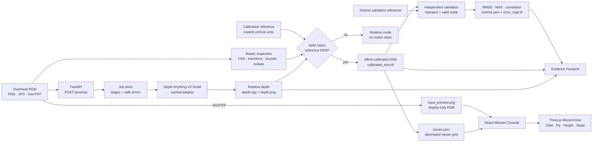
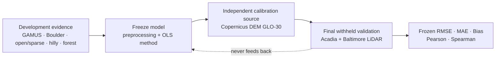

# ChakraVIEW

**From Orbit to Action.**

**AI-Powered 3D Terrain Intelligence for Disaster Management**

Smart India Hackathon · **SIH26175** · Internal repository identity: **DepthWizard**


ChakraVIEW transforms a single overhead RGB image into traceable terrain intelligence. It combines relative monocular-depth estimation, guarded geospatial calibration, metric digital surface model (DSM) reconstruction when an appropriate elevation reference is supplied, a browser-compatible RGB texture, interactive Three.js terrain inspection, and separately labeled validation and evidence outputs. It is designed for rapid remote inspection—not survey-grade reconstruction or automated hazard decisions.

<!-- Add: docs/assets/mission-setup.png -->
<!-- Add: docs/assets/missionview.png -->

**Navigate:** [System](#system-architecture) · [Pipeline](#end-to-end-pipeline) · [Data strategy](#data--evaluation-strategy) · [Final validation](#final-independent-validation) · [Quickstart](#quickstart) · [Live demo](#live-demo-guide)

## At a glance

| Question | Answer |
|---|---|
| Primary input | One overhead RGB PNG, JPG, or three-band GeoTIFF |
| Production model | Depth Anything V2 Small (`depth-anything/Depth-Anything-V2-Small-hf`) |
| Unreferenced output | Relative depth in arbitrary units; explicitly **not metric** |
| Metric path | Georeferenced RGB GeoTIFF + compatible reference DEM + affine calibration |
| Main metric artifact | Float32 georeferenced `calibrated_dsm.tif` |
| Independent evidence | A distinct withheld elevation raster, RMSE/MAE/correlation, and error map |
| Visualization | Textured heightfield in Three.js MissionView with Orbit, Fly, height, and slope tools |
| Deployment | Local FastAPI + React/Vite; cached model inference can run offline |
| Canonical demo | Boulder development scene; never used as final withheld validation |
| Final withheld scenes | Acadia terrain and Baltimore terrain/surface |

## What ChakraVIEW Does

The production workflow is:

```text
overhead RGB
  → relative monocular depth
  → source-grid and geospatial inspection
  → optional metric calibration
  → optional independent validation
  → DSM, terrain, preview, metadata, and evidence artifacts
  → local Mission Console and Three.js MissionView
```

ChakraVIEW has two deliberately different operating modes:

| Input and reference | Output mode | What can be claimed |
|---|---|---|
| PNG/JPG only | **RELATIVE DEPTH · NOT METRIC** | Relative scene ordering and model output; no metres, elevation, or engineering-grade slope |
| RGB GeoTIFF + valid metric reference DEM | **CALIBRATED · METRIC DSM** | An affine-calibrated DSM on the source grid, with the reference units and geospatial metadata recorded |

A separate validation GeoTIFF may be uploaded only after metric calibration. It is reprojected onto the prediction grid and evaluated over mutually valid pixels. It is not reused for affine fitting.

## SIH26175 / DepthWizard

SIH26175 asks how useful three-dimensional terrain information can be recovered from single-view overhead or remote-sensing imagery using pretrained monocular-depth methods, then calibrated, evaluated, visualized, and integrated into an operational system.

ChakraVIEW addresses that engineering-research boundary as one traceable application:

- ingest one overhead image while preserving available raster metadata;
- estimate relative geometry with a pretrained monocular model;
- anchor scale and offset only when an explicit metric elevation reference is valid;
- export a georeferenced DSM rather than a display-only array;
- provide Orbit and first-person terrain inspection;
- compute height and slope with unit-aware safeguards;
- keep calibration diagnostics separate from independent accuracy evidence; and
- package provenance, warnings, and artifacts for review or downstream GIS use.

The intended users are disaster-response analysts, geospatial teams, researchers, and planners who need a rapid first inspection when stereo imagery or a purpose-built survey is unavailable. ChakraVIEW supports analysis; it does not predict disasters or replace authoritative survey products.

## Why Single-View Terrain Reconstruction Is Hard

### Monocular scale ambiguity

A single RGB image does not contain a unique physical scale or vertical origin. A monocular model can recover useful relative structure while remaining unable to state metres above a datum.

### Remote-sensing domain gap and viewing geometry

Many monocular models learn from ground-level imagery. Nadir and near-nadir imagery has different texture, scale, object appearance, perspective, and depth statistics. Orthorectification further changes the relationship between appearance and height.

### Surface ambiguity

Trees, buildings, shadows, seasonal change, and occlusion influence RGB appearance. A model response may represent visible surface structure, bare-earth relief, or a mixture; that semantic meaning must not be assumed from the array alone.

### Resolution and reference mismatch

Fine RGB imagery may be calibrated against a much coarser DEM. Ordinary image resizing is not enough: the reference must be reprojected using CRS and affine transforms, with nodata excluded. A coarse reference cannot supervise fine rooftop or canopy detail.

### DEM/DSM semantics and time

A bare-earth DTM does not directly validate roofs or canopy in a DSM. Different acquisition dates can add real change. Horizontal CRS compatibility also does not establish compatible vertical units or datums.

## Scientific Guardrail: Relative Depth ≠ Metric Elevation

> Depth Anything V2 supplies relative, disparity-like geometry. ChakraVIEW never interprets its raw values as metres.

When a compatible reference raster is supplied, the current production calibration uses ordinary least squares to fit:

```text
metric_elevation = a × relative_depth + b
```

- `a` is the fitted scale multiplier between model values and reference elevation.
- `b` is the fitted vertical offset.
- Both are learned only from aligned, finite depth/reference pixel pairs.
- Failed or unverifiable calibration falls back to **relative / not metric** instead of inventing elevation units.

### Calibration-fit metrics are not independent validation

Calibration RMSE and R² describe residuals on the same reference pixels used to fit `a` and `b`. They answer “how well did this affine fit its anchors?” They do **not** answer “how accurate is the model on unseen evidence?”

Independent validation uses a different withheld raster. The API rejects an identical calibration/validation path or identical file content, and the Evidence Passport records that calibration-fit metrics are not independent validation.

## System Architecture



The canonical API and result boundary is documented in [`contracts/pipeline_contract.json`](contracts/pipeline_contract.json). A concise module description is available in [`docs/ARCHITECTURE.md`](docs/ARCHITECTURE.md).

## End-to-End Pipeline

| Stage | Input | Action | Output and scientific boundary |
|---:|---|---|---|
| 1. Mission input | RGB PNG/JPG/GeoTIFF; optional calibration and validation GeoTIFFs | Validate filenames and supported formats; store files in a job-scoped directory | A pending job and isolated inputs; no result is implied by upload success |
| 2. Input inspection | RGB source | Read dimensions/channels; for GeoTIFF read CRS, affine transform, bounds, pixel size, and nodata | Factual source metadata; a projected CRS alone does not prove vertical units |
| 3. Relative depth | RGB image | Run cached Depth Anything V2 Small and resize the prediction to the source H×W grid | `depth.npy`, `depth.png`, and model metadata in relative units |
| 4. Metric calibration | Relative depth + georeferenced source + reference DEM | Verify reference vertical units, geospatially align the DEM, and fit `E = aD + b` | Fit diagnostics; not independent accuracy |
| 5. DSM reconstruction | Valid finite depth samples + affine fit | Apply the fit and encode invalid samples as Float32 nodata | `calibrated_dsm.tif` with source CRS/transform/dimensions |
| 6. Terrain and texture | Metric DSM + RGB source | Decimate the elevation grid for rendering; create browser-compatible RGB preview for GeoTIFF input | `terrain.json` plus optional `input_preview.png`; the preview never changes scientific rasters |
| 7. MissionView | Viewer grid + preview | Build a Three.js heightfield and map the display texture | Interactive inspection, not a photogrammetric true mesh |
| 8. Measurements | Selected viewer-grid samples | Compute signed height difference and affine-derived horizontal run/slope where metric | Metres only for calibrated geospatial terrain; nodata samples are not measurable |
| 9. Independent validation | Calibrated DSM + distinct reference | Reproject reference to prediction grid and evaluate mutually valid pixels | `metrics.json` and absolute-error `error_map.tif`; no validation reference means no validation claim |
| 10. Evidence | Inputs, stages, model, calibration, validation, warnings | Serialize factual lineage and limitations | `evidence_passport.json`; confidence remains explicitly unimplemented |

## Production Model

**Model:** Depth Anything V2 Small

**Checkpoint:** [`depth-anything/Depth-Anything-V2-Small-hf`](https://huggingface.co/depth-anything/Depth-Anything-V2-Small-hf)

**Framework:** PyTorch through Hugging Face Transformers

**Output contract:** relative, arbitrary-unit, H×W depth/disparity-like array

The small checkpoint was selected as the production baseline because it combines a strong monocular prior, practical CPU/GPU execution, manageable integration complexity, a reproducible Transformers interface, and cache-only deployment. Selection reflects **scientific performance plus engineering feasibility**; it is not a claim that the model is universally best for overhead imagery.

The adapter validates RGB input, output shape, finiteness, device choice, and artifact reloads. A thread-safe process cache reuses the loaded default adapter across jobs with the same device, checkpoint, and offline policy.

## Model Selection Evidence

| Candidate | Development finding | Production decision |
|---|---|---|
| Depth Anything V2 Small | Weak-to-moderate but useful scene structure across development comparisons; simple, reproducible integration and practical runtime | **Frozen production model** for the best overall scientific/engineering balance |
| OccuFly UAV fine-tune | Some competitive calibration-fit behavior, but poor independent surface-structure correlation on the evaluated overhead scene | Not adopted; good fit statistics did not translate into reliable surface detail |
| AerialMetric / MoGe2-Aerial | Stronger structural research evidence in some development comparisons | Not adopted for the hackathon build because deployment and integration tradeoffs were materially higher |

These are development/model-selection findings, not final withheld test results. No final Acadia or Baltimore LiDAR was used to choose the production model.

# Data & Evaluation Strategy

ChakraVIEW assigns every dataset one role. Development evidence may influence model or method choice. Calibration data may fit metric scale and offset. Final withheld data may only measure the frozen system.



## A. Development / model evidence

| Evidence domain | Purpose | Role |
|---|---|---|
| GAMUS subsets | Recommended overhead remote-sensing domain evidence | Development and model comparison only |
| Boulder | Mixed urban/vegetated surface and terrain behavior; full live-demo rehearsal | Development/demo only; explicitly protected from final validation |
| Great Salt Lake Desert | Sparse/open terrain behavior | Development evidence |
| Badlands | Hilly, eroded, high-relief structure | Development evidence |
| Olympic / forest | Vegetation and canopy-domain behavior | Development evidence |

Development scenes are not pooled with the final withheld metrics.

## B. Calibration

Copernicus DEM GLO-30 supplies the external metric anchor for the frozen final protocol. It is used to fit the affine scale/offset and is not the final LiDAR truth.

## C. Final withheld validation

- **Acadia / Mount Desert Island:** terrain DTM validation.
- **Baltimore:** terrain DTM and visible-surface DSM evaluation.

The registry marks these scenes as excluded from model training/selection, calibration-method selection, hyperparameter or threshold tuning, architecture selection, smoothing-scale selection, and qualitative comparison. See [`configs/dataset_registry.json`](configs/dataset_registry.json).

## GAMUS Domain Evidence

GAMUS was used as official/recommended overhead remote-sensing domain evidence. ChakraVIEW used small, fixed subsets for development comparisons; it does not commit or imply use of the entire roughly 80 GB collection.

Fixed held-out scene identifiers in the project protocol are:

- `DC_02_26`
- `DC_76_32`
- `PHL_6150`
- `PHL_6925`

These identifiers support repeatable development comparisons. They are not the Acadia/Baltimore final-withheld set, and no GAMUS metric is presented here as final system accuracy.

## Live Demo Scene — Boulder

Boulder Downtown–University is the canonical live scene because the complete production path has been exercised end to end on a 2 km mixed urban/vegetated crop.

| Role | File | Notes |
|---|---|---|
| RGB GeoTIFF | `sample_data/real_demo/real_rgb_geotiff.tif` | Three-band NAIP-derived RGB on an EPSG:32613 grid |
| Metric calibration | `sample_data/real_demo/boulder_copernicus_calibration_dem.tif` | Prepared Copernicus GLO-30 reference with explicit metre/EGM2008 metadata |
| Relative-mode input | `sample_data/real_demo/boulder_relative_demo.jpg` | JPG-only demonstration; remains relative/not metric |

The metric demo produces relative depth, a calibrated DSM, a browser RGB preview, textured MissionView, Orbit/Fly interaction, height/slope tools, and an Evidence Passport. **Boulder is development/demo data, not final withheld validation.** Its identity is explicitly protected from final-validation eligibility by the dataset registry.

Large local GeoTIFFs, the accompanying local provenance record, and generated outputs are ignored by Git. The provenance record for the prepared Boulder reference is [`sample_data/real_demo/boulder_copernicus_calibration_provenance.json`](sample_data/real_demo/boulder_copernicus_calibration_provenance.json).

## Metric Calibration with Copernicus DEM GLO-30

Copernicus DEM GLO-30 is an approximately 30 m elevation product. The prepared Boulder calibration artifact records metre units, EGM2008 height (`EPSG:3855`), a 30 m grid, and its exact source tile/checksums. No vertical transformation was applied to that Boulder artifact.

For the final Acadia/Baltimore protocol, the registry records separately prepared GLO-30 calibration rasters transformed to the declared NAVD88/GEOID18 vertical reference before withheld inference. Those calibration rasters are independent of the withheld LiDAR and are ineligible as validation truth.

The calibration pipeline:

1. reads and verifies explicit reference vertical units;
2. reprojects/resamples the reference onto the source depth grid;
3. excludes non-finite/nodata pairs;
4. fits the global affine mapping; and
5. exports calibration coefficients, fit statistics, source/output metadata, and warnings.

Because GLO-30 is coarse and represents a surface product, it can limit absolute accuracy and cannot provide fine supervision for individual buildings or canopy. Calibration improves unit interpretation; it does not remove monocular ambiguity or semantic mismatch.

# Final Independent Validation

The following values are the frozen final results. They are reported separately by reference semantics; calibration-fit statistics are not substituted for these results.

| Final evaluation | RMSE (m) | MAE (m) | Bias (m) | Pearson r | Spearman ρ | Interpretation |
|---|---:|---:|---:|---:|---:|---|
| Acadia terrain | 49.602253 | 41.738748 | +0.745745 | 0.732946 | 0.744906 | Strong terrain ordering/structure, weak absolute metric accuracy |
| Baltimore terrain | 7.475677 | 6.283622 | +3.132714 | 0.051376 | 0.099467 | Lower absolute error, weak fine bare-earth terrain correlation |
| Baltimore DSM | 30.781048 | 19.681259 | −16.009874 | 0.625515 | 0.658417 | Meaningful visible surface structure, imperfect absolute heights |

### Acadia terrain

Acadia tests high-relief terrain structure against a frozen terrain DTM. Correlation is meaningful, but the large RMSE/MAE prevents a high-accuracy elevation claim.

### Baltimore terrain and surface

Baltimore separates two questions. The DTM comparison has lower absolute error but weak terrain ranking at fine scale. The DSM comparison shows substantially stronger surface-structure correlation while retaining material height bias and error. This is why one scalar metric cannot summarize system behavior.

## How to Read the Metrics

| Metric | Meaning | Caution |
|---|---|---|
| RMSE | Square-root mean squared elevation error; penalizes large residuals strongly | Sensitive to outliers and vertical/reference mismatch |
| MAE | Mean absolute elevation error | Easier to interpret than RMSE, but does not describe structural ordering |
| Bias | Mean signed residual | Positive and negative local errors can cancel |
| Pearson r | Strength of linear association | High correlation can coexist with poor scale/offset and large absolute error |
| Spearman ρ | Agreement in rank ordering | Captures monotonic structure, not correct physical height |

Acadia demonstrates that good ordering does not guarantee low metric error. Baltimore terrain demonstrates that a lower RMSE does not necessarily imply strong structural ranking. Baltimore DSM shows useful surface correlation without survey-grade absolute height.

## Scientific Integrity / Leakage Prevention

- [x] Production model frozen before final withheld validation.
- [x] Preprocessing and ordinary-least-squares calibration method frozen before first withheld inference.
- [x] Final LiDAR excluded from affine fitting.
- [x] Development and final geographies separated in a validated registry.
- [x] No post-result crop, mask, interpolation, smoothing, or threshold tuning.
- [x] Calibration-fit RMSE/R² labeled as fit diagnostics, never final accuracy.
- [x] Acadia limited to terrain validation; no canopy/surface claim is made from its DTM.
- [x] Direct nDSM validation withheld unless a semantically compatible predicted nDSM exists.
- [x] Integrity corrections require a new dataset version rather than silent mutation.

## DEM, DTM, DSM, and nDSM

| Term | Meaning | ChakraVIEW relevance |
|---|---|---|
| DEM | General elevation-raster term; product semantics must still be identified | May be a calibration or validation source only when units, grid, and role are explicit |
| DTM | Bare-earth terrain elevation | Appropriate for terrain relief; cannot directly validate rooftops or canopy |
| DSM | Elevation of visible/top surfaces, including structures and vegetation where captured | Closest semantic target for a surface-height prediction |
| nDSM | Normalized surface height, commonly `DSM − DTM` | Requires compatible DSM/DTM references and a compatible predicted product; not inferred by label alone |

**A bare-earth DTM cannot directly validate rooftops or canopy.** Temporal, resolution, and nodata differences still matter even when product names appear compatible.

## Geospatial Safety Guardrails

- **Horizontal CRS is not a vertical datum.** A projected grid may describe x/y in metres without proving that raster values are metre elevations.
- **Vertical units are explicit.** A calibration reference without declared band units or `VERTICAL_UNITS` metadata is rejected. Missing vertical-datum metadata is surfaced as a warning rather than silently invented.
- **Alignment is geospatial.** Rasterio reprojects the reference using source/destination CRS, affine transforms, nodata, and bilinear resampling; it does not use ordinary pixel resize as evidence of alignment.
- **The source grid is authoritative.** The DSM is reopened and checked for CRS, affine transform, dimensions, nodata, and band description.
- **Nodata is preserved.** Invalid scientific samples are encoded as `-9999.0` in the authoritative DSM and as JSON `null` in terrain export. Validation uses mutually valid pixels only.
- **Rendering gaps do not rewrite data.** MissionView uses nearest-valid fill only for visual continuity and prevents measurements on originally invalid cells.
- **Transform order is recorded.** GDAL-order and Affine-order arrays are labeled to avoid silent coordinate swaps.
- **Safe fallback is relative.** A failed or absent calibration never relabels arbitrary model values as metres.

## MissionView — Interactive 3D Terrain Intelligence

MissionView renders a **heightfield**, not a photogrammetric true mesh. Three.js triangulates the viewer grid, applies vertical exaggeration for legibility, and optionally maps a display texture derived from the source RGB.

Implemented controls:

- **Orbit:** drag to rotate, scroll to zoom, and pan through `OrbitControls`.
- **Fly:** pointer-lock first-person mode with mouse look and WASD movement.
- **Escape:** exits pointer lock.
- **Height:** selects two valid samples and reports signed elevation difference.
- **Slope:** combines vertical difference with affine-derived horizontal distance when metric.
- **Reset:** restores the camera and clears interaction state.
- **Texture:** GeoTIFF bands 1–3 are converted locally into `input_preview.png`; the scientific GeoTIFF and DSM remain untouched.
- **Fallback:** if the optical texture cannot load, a neutral terrain material remains available.

Relative terrain never claims metre measurements. Vertical exaggeration changes display geometry only, not reported source elevations.

## Mission Console

The desktop-focused React interface is designed around approximately 1440×900 and remains usable at 1280×720. It has a Pale Lime-Sand workflow rail, light central workspace, and a spatial drawer for MissionView.

| Workspace | Purpose |
|---|---|
| Mission Setup | Select RGB, calibration DEM, and separate validation reference; explain relative versus metric modes |
| Processing | Display real job/stage state and model/calibration telemetry without fabricated progress |
| 3D Analysis / MissionView | Inspect textured terrain, navigate, measure height/slope, and read spatial metadata |
| Validation | Separate current independent results, calibration-fit diagnostics, and the frozen benchmark ledger |
| Evidence Passport | Review provenance and download job artifacts |

The custom ChakraVIEW logo and all application styles are local. No Stitch service, Stitch API key, Google AI Studio, remote font, or external design runtime is required. Use the sidebar or `Ctrl+1` through `Ctrl+5` to switch workspaces; shortcuts are ignored while a form input, text area, or select is focused.

## Evidence Passport

Every successful production job writes `evidence_passport.json`. It records:

- input filename/type and whether the source is georeferenced;
- production model/checkpoint and relative-depth mode;
- calibration method, source, scale, offset, fit scope, and fit metrics;
- reference and output vertical units/datum/CRS when available;
- source/output CRS and affine transform order;
- independent validation status and metrics when performed;
- error-map presence, warnings, and explicit unavailable fields; and
- the fact that confidence is not implemented and calibration fit is not validation.

Provenance matters in disaster workflows because a number without its source, unit, datum, processing role, and limitations is easy to misuse. The passport makes those boundaries inspectable alongside the artifacts.

## Generated Artifacts

Artifacts live below ignored, job-scoped `outputs/<job-id>/` directories and are exposed only through a job-owned allowlist.

| Artifact | Availability | Purpose |
|---|---|---|
| `depth.npy` | Every successful real-depth job | Authoritative relative H×W float array |
| `depth.png` | Every successful real-depth job | Grayscale relative-depth preview |
| `model_metadata.json` | Every successful real-depth job | Checkpoint, device, runtime, preprocessing, shape, and cache provenance |
| `input_preview.png` | GeoTIFF input when RGB preview conversion succeeds | Browser display texture only; not a scientific raster |
| `calibrated_dsm.tif` | Metric calibration only | Float32 DSM with source grid and `-9999.0` nodata |
| `terrain.json` | Metric calibration only | Decimated, Three.js-friendly metric grid with JSON-null nodata |
| `calibration.json` | Metric calibration only | OLS coefficients, fit diagnostics, and reference/output metadata |
| `mock_terrain.json` | Uncalibrated real-depth path | Explicitly synthetic viewer placeholder; not terrain or elevation |
| `evidence_passport.json` | Every successfully completed production job | Provenance, warnings, roles, and scientific limitations |
| `metrics.json` | Successful independent validation only | RMSE, MAE, correlation, overlap, units, and alignment diagnostics |
| `error_map.tif` | Successful independent validation only | Float32 absolute-error raster on the prediction grid |

Unknown, unavailable, or inapplicable values remain null/absent rather than being fabricated.

## API Overview

The API has no `/api` prefix in the current implementation.

| Method | Route | Purpose |
|---|---|---|
| `GET` | `/health` | Report API availability without loading the model |
| `POST` | `/process` | Upload RGB and optional `reference_dem` / `validation_reference`; returns HTTP 202 job state |
| `POST` | `/jobs` | Create an empty pending job (infrastructure endpoint) |
| `GET` | `/jobs/{job_id}` | Poll job and six pipeline-stage states |
| `GET` | `/jobs/{job_id}/result` | Return the completed result or HTTP 409 while unavailable |
| `GET` | `/jobs/{job_id}/artifacts/{artifact_name}` | Download an allowlisted, job-owned artifact |

Metric submission example:

```powershell
curl.exe -X POST http://127.0.0.1:8000/process `
  -F "file=@sample_data/real_demo/real_rgb_geotiff.tif" `
  -F "reference_dem=@sample_data/real_demo/boulder_copernicus_calibration_dem.tif"
```

Add a genuinely distinct `validation_reference` only when its provenance and scientific role are valid. The normal frontend submits `mode=real`; `fallback_mock` exists for explicit software fallback/testing and is never presented as measured performance.

## Repository Structure

```text
depthwizard-sih26175/
├── backend/
│   ├── routes/                 # health, jobs, process, artifact delivery
│   ├── schemas/                # job/stage/error contracts
│   ├── services/               # orchestration, depth adapter, validation
│   │   └── ayush/              # geospatial alignment, OLS calibration, export
│   ├── evaluation/             # synthetic ProofBench aggregation
│   ├── tests/                  # backend integration/unit tests
│   └── tools/                  # offline environment readiness check
├── frontend/                   # React/Vite Mission Console and Three.js viewer
├── contracts/                  # canonical API/result contracts
├── configs/                    # frozen dataset registry
├── evaluation/                 # synthetic software-integration manifest/summary
├── sample_data/                # demo conventions; local real-demo assets stay untracked
├── docs/                       # architecture, demo, judge Q&A, recovery guidance
├── tests/                      # dataset-registry/final-validation boundary tests
├── requirements.txt
└── README.md
```

Large/private imagery, model caches, and outputs are intentionally excluded from version control.

# Quickstart

## Requirements

- Windows (primary tested environment)
- Python 3.12
- Node.js 20.19 or newer
- RAM and disk for PyTorch, Transformers, and model weights
- Optional CUDA-capable GPU; CPU inference is supported

## 1. Create the Python environment

From the repository root in Command Prompt:

```bat
py -3.12 -m venv .venv312
.venv312\Scripts\activate
python -m pip install --upgrade pip
python -m pip install -r requirements.txt
```

## 2. Install the frontend

```bat
cd frontend
npm install
cd ..
```

## 3. Prepare the model cache

Normal application inference uses `local_files_only=True`; it will not silently download missing weights. Populate the cache once in an explicitly online preparation environment, then verify it before going offline.

```powershell
$env:HF_HOME = "$PWD\outputs\.hf_cache"
python -c "from transformers import AutoImageProcessor, AutoModelForDepthEstimation; m='depth-anything/Depth-Anything-V2-Small-hf'; AutoImageProcessor.from_pretrained(m); AutoModelForDepthEstimation.from_pretrained(m)"
python backend\tools\check_environment.py
```

Model weights are not committed. Review and comply with the upstream model terms before downloading.

## 4. Start the backend

```bat
.venv312\Scripts\activate
python -m uvicorn backend.main:app --reload --host 127.0.0.1 --port 8000
```

Health check: `http://127.0.0.1:8000/health`

## 5. Start the frontend

In a second terminal:

```bat
cd frontend
npm run dev
```

Open `http://localhost:5173/`. Override the backend URL with `VITE_API_BASE_URL` when required.

## PyTorch / Device Setup

`requirements.txt` allows PyTorch 2.x within the tested dependency range. Install the CPU or CUDA build that matches the target machine; do not apply a CUDA-specific wheel universally. Consult the official PyTorch installer selector, then install the remaining requirements. At runtime, `device=auto` chooses CUDA when `torch.cuda.is_available()` and otherwise uses CPU. Explicitly requesting CUDA on a machine without it raises a clean error.

## Offline / On-Premise Operation

The production adapter is created with `local_files_only=True`, and the default model cache lives under `outputs/.hf_cache` unless `HF_HOME` is set before startup. A thread-safe module cache reuses the loaded adapter per process instead of loading a new model for each job.

For an already populated cache, optional environment flags can reinforce offline behavior:

```powershell
$env:HF_HOME = "$PWD\outputs\.hf_cache"
$env:HF_HUB_OFFLINE = "1"
$env:TRANSFORMERS_OFFLINE = "1"
python backend\tools\check_environment.py
python -m uvicorn backend.main:app --host 127.0.0.1 --port 8000
```

No normal inference-time download is required. A missing processor or checkpoint raises a sanitized model-load failure; it does not fall back to fake metric output. This supports controlled, low-connectivity, and on-premise demonstrations.

## Performance Snapshot

The following are prior single-environment benchmark observations, **not universal latency or memory guarantees**. Model cache state, CPU/GPU, image size, storage, and process lifetime materially affect results.

| Environment | Model load | Inference | First total | Memory observation |
|---|---:|---:|---:|---|
| CPU benchmark | ~10.007 s | ~1.398 s | ~11.405 s | Peak RSS ~0.983 GB |
| RTX 4060 benchmark | ~8.396 s | ~0.578 s | ~8.974 s | CUDA allocated ~0.264 GB; reserved ~0.381 GB |

The current production path reuses the adapter within a process, so subsequent jobs avoid repeated model construction and are substantially faster than a cold load. No warmed-job SLA is claimed.

## Verification Status

Verified on the current `Shawn` branch after the frontend integration:

| Check | Result |
|---|---|
| Backend project suite | **105 passed, 5 skipped** (`python -m pytest backend/tests tests -q`) |
| Frontend analysis suite | **6 passed** (`npm run test:analysis`) |
| Frontend production build | **PASS** (`npm run build`); Three.js bundle-size warning is non-blocking |
| Whitespace validation | **PASS** (`git diff --check`) |
| Frontend viewport review | **PASS** at 1440×900 and 1280×720 |

The five skipped backend tests are environment-dependent real-model smoke checks covering local cache/image availability and CUDA-specific execution; they skip rather than download weights or assume unavailable hardware.

To rerun the same checks:

```bat
.venv312\Scripts\activate
python -m pytest backend\tests tests -q
cd frontend
npm run test:analysis
npm run build
```

The committed ProofBench scenes under `evaluation/` are synthetic software-integration evidence only. Their favorable values are not field accuracy.

## Disaster-Management Applications

ChakraVIEW is designed to support, with qualified interpretation:

- rapid terrain inspection where only one overhead image is immediately available;
- landslide terrain and slope assessment with an appropriate calibrated reference;
- flood-terrain understanding and broad drainage/relief context;
- post-disaster visual inspection of accessible overhead imagery;
- preliminary route, access, and line-of-sight planning; and
- offline remote-terrain intelligence in controlled environments.

It does not provide disaster prediction, live hazard monitoring, guaranteed detection, or autonomous emergency decisions.

## What Makes ChakraVIEW Different

- **Safe dual-mode workflow:** relative output remains visibly non-metric until a reference passes validation.
- **Explicit metric-unit guard:** x/y CRS units are not confused with elevation units.
- **Calibration/validation separation:** fit residuals and withheld accuracy are different data paths and UI states.
- **Evidence Passport:** provenance, units, transforms, warnings, and limitations travel with the result.
- **Textured MissionView:** the calibrated heightfield and source RGB can be inspected locally with unit-aware tools.
- **Independent withheld evidence:** frozen Acadia/Baltimore LiDAR results are reported without post-result tuning.
- **Domain-aware evaluation:** overhead urban, open, hilly, and vegetated behavior informed development.
- **Offline model operation:** production uses cache-only loading and per-process adapter reuse.
- **One-image workflow:** a single RGB input can produce immediate relative evidence and, with a valid reference, a calibrated terrain product.

These are system-design differentiators, not claims that every component is individually novel.

## Current Limitations

- Monocular scale and offset are fundamentally ambiguous without external reference data.
- Metric accuracy is scene-dependent; final results vary strongly by terrain and reference semantics.
- Depth Anything V2 is not trained exclusively for this overhead domain.
- Global OLS cannot represent spatially varying bias or non-linear depth/elevation relationships.
- Coarse calibration data limits fine-scale absolute height recovery.
- DEM/DTM/DSM mismatch can dominate evaluation, especially around buildings and canopy.
- Shadows, vegetation, roof appearance, occlusion, and orthorectification affect inferred structure.
- Imagery, calibration, and validation products can have temporal mismatch.
- Vertical-datum compatibility must be established externally; not every raster carries sufficient metadata.
- MissionView measurements use a decimated display grid rather than sub-pixel source samples.
- Relative mode uses an explicitly synthetic viewer placeholder; it is not a metric terrain reconstruction.
- The Three.js bundle is currently large and not lazy-loaded.
- ChakraVIEW has no survey-grade guarantee and is not a disaster-prediction system.

## Safe Claims / Do Not Claim

| Safe to claim | Do not claim |
|---|---|
| Independent withheld validation was completed on frozen Acadia/Baltimore roles | Survey-grade elevation accuracy |
| Some scenes show meaningful terrain or surface structural correlation | Universal high-precision DSM reconstruction |
| PNG/JPG produces relative depth and is labeled not metric | Monocular depth alone produces true elevation |
| A valid DEM can fit a global metric scale and offset | Calibration guarantees independent accuracy |
| Cached inference can run without normal model downloads | No hardware, cache, or storage constraints |
| MissionView supports local Orbit/Fly and unit-aware measurements | A photogrammetric true mesh or full 3D reconstruction |
| The system supports disaster-terrain inspection | Disaster prediction or autonomous hazard decisions |
| Evidence Passport records provenance and limitations | Evidence metadata replaces independent validation |

# Live Demo Guide

## Before the presentation

1. Activate `.venv312` and run `python backend\tools\check_environment.py`.
2. Confirm both servers start and `/health` returns `{"status":"ok","service":"depthwizard-api"}`.
3. Confirm the three Boulder demo files exist locally; GeoTIFFs are ignored and may not be present in a fresh clone.
4. Keep Acadia/Baltimore final data out of the demo and out of calibration.

## Metric Boulder demo

1. Open **Mission Setup** (`Ctrl+1`).
2. Select `sample_data/real_demo/real_rgb_geotiff.tif`.
3. Select calibration reference `sample_data/real_demo/boulder_copernicus_calibration_dem.tif`.
4. Do not submit a validation reference unless demonstrating a genuinely separate, provenance-approved check.
5. Choose **Analyze Terrain** and follow the real stage states in **Processing** (`Ctrl+2`).
6. Open **MissionView** (`Ctrl+3`) after completion.
7. Show the RGB texture, then Orbit and Reset.
8. Select Fly, click the viewport to enter pointer lock, use WASD/mouse look, and press Esc to release.
9. Return to Orbit and demonstrate Height and Slope on valid terrain samples.
10. Open **Evidence Passport** (`Ctrl+5`) and show/download the DSM, calibration metadata, terrain, and provenance record.

## Relative-only demo

1. Select `sample_data/real_demo/boulder_relative_demo.jpg` without a DEM.
2. Run the pipeline and point out **RELATIVE DEPTH · NOT METRIC**.
3. Show `depth.png`/`depth.npy`; do not interpret values as metres.
4. Explain that the relative viewer fallback is synthetic and cannot support metric hazard claims.

## Visual Walkthrough

<!-- Add: docs/assets/mission-setup.png -->
<!-- Add: docs/assets/processing.png -->
<!-- Add: docs/assets/missionview-textured.png -->
<!-- Add: docs/assets/validation.png -->
<!-- Add: docs/assets/evidence-passport.png -->
<!-- Add: public demo video URL when published; do not insert a placeholder link. -->

The concise presentation sequence and judge-safe answers remain in [`docs/DEMO_SCRIPT.md`](docs/DEMO_SCRIPT.md) and [`docs/JUDGE_QA.md`](docs/JUDGE_QA.md).

## Team

| Member | Contribution |
|---|---|
| **Shawn** | Lead; architecture, backend integration, frontend, MissionView, and final scientific integration |
| **Manish** | Monocular depth, model evaluation, and runtime/offline hardening |
| **Ayush** | Calibration, geospatial processing, provenance, and metric-safety hardening |
| **Harinandana** | Validation infrastructure, dataset registry, and validation documentation |
| **Devananda** | Research, presentation deck, and video support |
| **Anamika** | Research, video, and presentation support |

## Future Work

- expand licensed multi-scene operational demos without weakening data-role separation;
- evaluate or fine-tune domain-specific overhead monocular-depth models;
- learn uncertainty/trust maps and calibrate them against real error evidence;
- move beyond a global affine fit where independently justified;
- improve DSM/DTM/nDSM semantic matching and evaluation;
- add richer surface reconstruction while retaining source-elevation traceability;
- add native contours, layers, sections, and GIS-oriented interaction;
- improve vertical-datum transformation and metadata tooling;
- grow the frozen withheld-validation suite across climate and terrain domains;
- package reproducible GPU/on-premise deployment; and
- investigate terrain-change workflows with temporally compatible imagery.

Future items are not current features.

## Data / Technology Acknowledgements

ChakraVIEW builds on or evaluates data and technology from:

- ISRO / Space Applications Centre and the SIH26175 problem context;
- GAMUS remote-sensing domain evidence;
- Copernicus DEM GLO-30;
- USGS 3DEP LiDAR/elevation and USDA NAIP/state aerial imagery;
- Depth Anything V2 and Hugging Face Transformers;
- FastAPI, PyTorch, Rasterio/GDAL, NumPy, Pillow, React, Vite, and Three.js.

Source-specific provenance and checksums belong with each dataset record. External data, model, and software names do not imply endorsement. This repository currently has no project-level license file; do not infer rights to external imagery, elevation data, model weights, or project code beyond their respective upstream terms.

## Project State and Recovery

- GeoTIFF RGB texture preview: commit `44a33de786270ea9ab1a0b3638baa10f4426d143`
- Mission Console frontend integration: commit `552070c1245bc0160977e791c60372b3e2a5c162`
- Frozen rollback tag: `chakraview-sih26175-final`

The rollback tag predates the final frontend polish and remains a recovery point. Do not move it. Recovery guidance is documented in [`docs/RECOVERY.md`](docs/RECOVERY.md).
